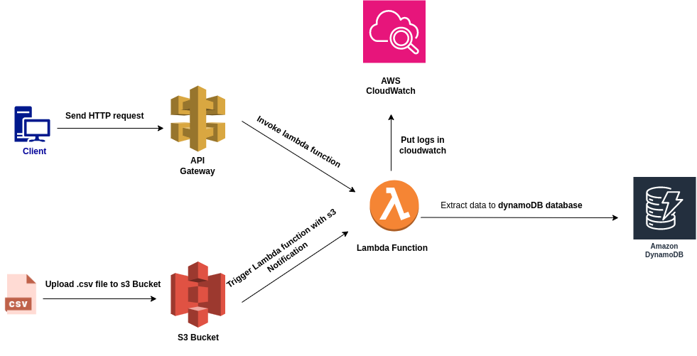

# Description
This is a minilab that involves a Serverless Architecture using Lambda, s3 and dynamodb .  
The idea is whenever a .csv file is uploaded to the s3 bucket a python lambda function is triggered to process and extract that data in a dynamodb Table.  
Additionally we can invoke the lambda Function via a HTTP request using API Gateway

